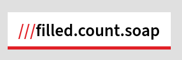

# What3words-svelte

A [Svelte](https://svelte.dev/) component to display a [what3words](https://what3words.com/) address, complying with [their best practices](https://developer.what3words.com/design/formatting-best-practice).

## Usage

```svelte
<script lang="ts">
	import What3words from 'what3words-svelte';
</script>

<What3words>filled.count.soap</What3words>
<What3words>your.three.words</What3words>
```

## Demo


